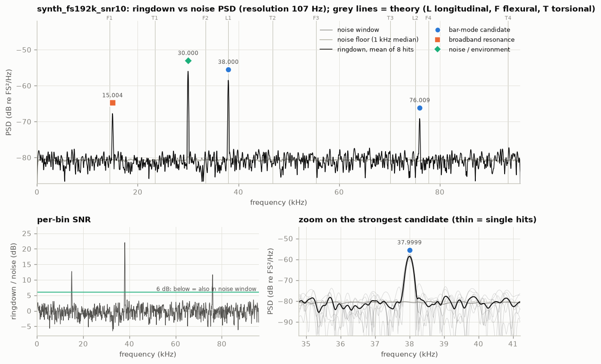
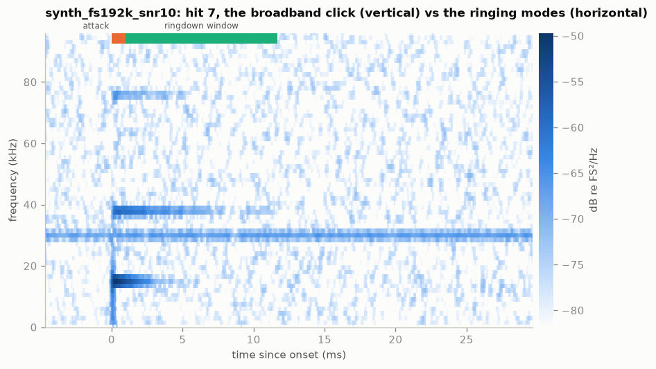
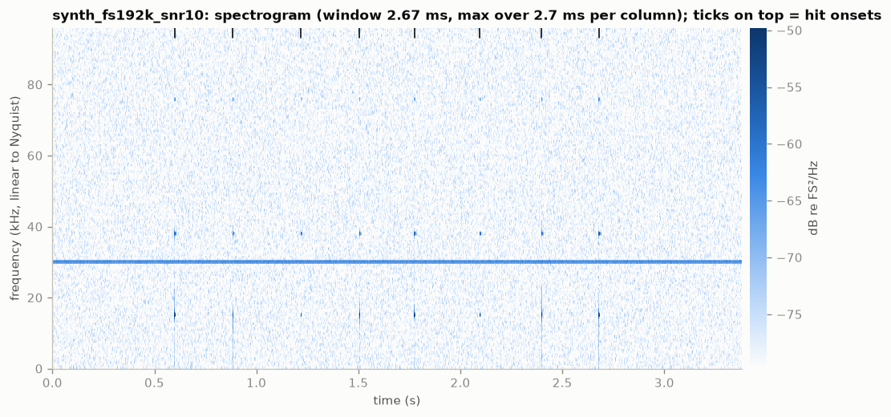
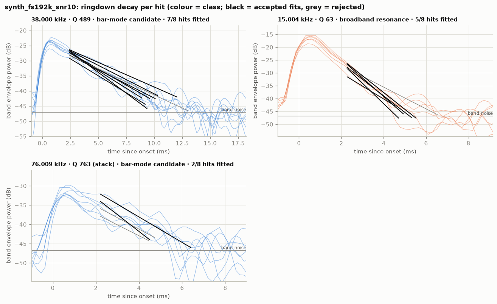
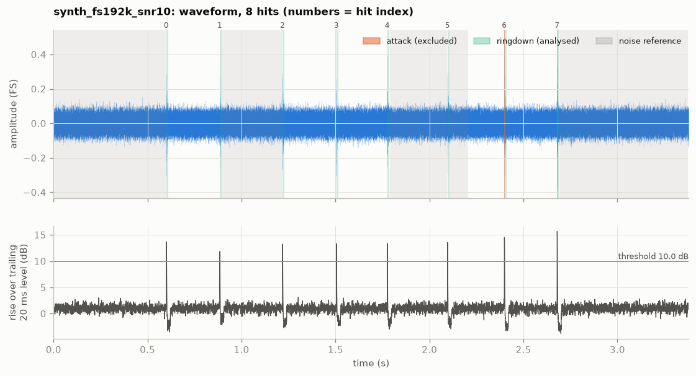

# synth_fs192k_snr10: bar ringing analysis (2026-10-06)

`data/synthetic/synth_fs192k_snr10.wav` · sha256 `8612ae062436` · 192 kHz, 16-bit, 1 ch,
3.3796 s · barlab 0.1.0 · data: [`result.json`](../synth_fs192k_snr10/result.json)

## Verdict

Ringing frequency: **37 999.9 ± 5.71 Hz** (spread over 8 hits; standard error 2.53 Hz),
Q ≈ 489 (per-hit fits, 7 of 8 hits). This is the strongest candidate: high Q, consistent across
hits, and 22 dB above the noise window.
Second candidate: **76 009.4 ± 38.20 Hz** (spread over 7 hits; standard error 18.1 Hz), Q ≈ 763
from the hit-averaged stack, because only 2 of 8 hits gave a clean per-hit fit. At 11.7 dB it is
weak, and its Q is the least certain number in this file.
This is a synthetic file written by `barlab demo`, so it tests the pipeline, not a real bar.

## Recording quality

- **Sample rate / format:** 192000 Hz (Nyquist 96000 Hz), PCM_16, 1 channel (analysed: 0),
  3.3796 s; device: none (synthetic, no GUANO metadata).
- **Warnings:** `INFO RESOLUTION_COARSE`. At this noise level the ringdowns rise above the noise
  for only 9.3 ms (median), which allows 107 Hz PSD resolution instead of ≤ 50 Hz. The quoted
  frequencies come from per-hit phase fits and do not depend on it.
- **Hits:** 8 detected; ringdowns 8.0–10.7 ms, all ending in the noise, not at the next hit;
  clipping none; noise reference 2.0 s, no fallback.
- **Spectral resolution:** 107.1 Hz (target ≤ 50 Hz, missed because of the short usable
  ringdowns); frequencies come from per-hit phase fits, which are much finer than the PSD grid.
- **Ultrasonic content:** strongest excess above 20 kHz 21.9 dB; no roll-off.

## Detected peaks

| # | f (Hz) | ± σ hits (Hz) | Q | τ (ms) | SNR (dB) | above floor (dB) | hits fitted | class | nearest theory |
|---|---|---|---|---|---|---|---|---|---|
| 0 | 15 004.0 | 20.30 | 62.6 ± 8.94 | 1.33 | 12.7 | 12.9 | 5/8 | broadband_resonance | flexural n=1 (+4.16%) |
| 1 | 30 000.5 | — | — | — | 0.1 | 23.8 | 0/8 | noise_or_environment | flexural n=2 (-10.30%, ambiguous) |
| 2 | 37 999.9 | 5.71 | 489 ± 90.4 | 4.1 | 22.0 | 22.1 | 7/8 | bar_mode_candidate | longitudinal n=1 (-0.00%) |
| 3 | 76 009.4 | 38.20 | 763 ± 113 (stack) | 3.19 | 11.7 | 11.8 | 2/8 | bar_mode_candidate | longitudinal n=2 (+1.17%, ambiguous) |

"± σ hits" is the spread of the per-hit frequencies, and "±" after Q is the spread of the per-hit
Q values. "(stack)" means Q comes from the hit-averaged envelope. SNR compares the ringdowns with
the noise window. Theory uses the sidecar bar: L = 66.257 mm, d = 16 mm, aluminium, free-free.

## Interpretation

- **Measured:**
  - 37 999.9 Hz with a per-hit spread of 5.71 Hz (standard error 2.53 Hz, n = 8), Q 489 ± 90.4
    (τ 4.1 ms, 7 of 8 hits fitted), SNR 22.0 dB.
  - 76 009.4 Hz with a spread of 38.20 Hz (standard error 18.1 Hz, 7 per-hit frequencies), Q 763
    from the stacked envelope (τ 3.19 ms), SNR 11.7 dB.
  - 15 004.0 Hz decays fast: Q 62.6, τ 1.33 ms.
  - 30 000.5 Hz is 23.8 dB above the floor but only 0.1 dB stronger after hits than without them.
- **Inferred:**
  - 38.0 kHz is a bar mode: high Q, consistent, absent from the noise window. 76.0 kHz passes the
    same tests, but with less margin: it is weak and noisy per hit (`q_from_stack`), and
    `decay.png` shows only 2 accepted per-hit fits.
  - 38.0 kHz matches longitudinal n = 1: Rayleigh–Love gives 38 000.2 Hz (−0.00 %, unambiguous).
    The match is **circular by construction**, since the sidecar L was set from the injected
    frequency. The family of 76.0 kHz is not identified: longitudinal n = 2 is 1.17 % below it,
    and the match is ambiguous.
  - 15.0 kHz is a broadband (mount or mic) resonance with Q < 100. 30.0 kHz is an environment
    line. Neither is the bar.
  - Ground truth (`data/synthetic/synth_fs192k_snr10.truth.json`), injected against measured:

    | component | injected | measured |
    |---|---|---|
    | first bar mode | 38 000.0 Hz, Q 500 | 37 999.9 Hz, Q 489 |
    | second bar mode | 76 000.0 Hz, Q 800 | 76 009.4 Hz, Q 763 |
    | mount resonance (15 kHz, Q 60) | — | broadband_resonance |
    | 30 kHz line | — | noise_or_environment |

    Every injected value lies within one per-hit spread (σ) of the measurement, so at this SNR
    the uncertainties are honest rather than optimistic. The click is not reported as a peak.
- **Caveats:**
  - This is the noisiest file of the set. The PSD resolution is 107 Hz, so lines closer than that
    would merge. The 15 kHz and 76 kHz fits used only part of the hits.
  - The signal is synthetic: an ideal mic and clean exponential decays.

## Comparison with previous recordings

| this f (Hz) | other recording | recorded | other f (Hz) | Δf = this − other (Hz) | Δf (ppm) | significance (Δf in σ) | Q this/other |
|---|---|---|---|---|---|---|---|
| 37 999.9 | synth_fs192k_snr20 | 2026-10-06 | 38 000.5 | -0.60 | -16 | 0.2 | 0.97 |
| 37 999.9 | synth_fs192k_snr40 | 2026-10-06 | 38 000.1 | -0.20 | -5 | 0.1 | 0.97 |
| 76 009.4 | synth_fs192k_snr20 | 2026-10-06 | 76 001.9 | 7.50 | 99 | 0.4 | 0.97 |
| 76 009.4 | synth_fs192k_snr40 | 2026-10-06 | 76 000.3 | 9.10 | 120 | 0.5 | 0.94 |

Both modes appear again in the cleaner files. The 76 kHz offsets reach 120 ppm, but at ≤ 0.5σ they
are explained by this file's larger uncertainty. There is no significant change, as expected for
the same synthetic bar.

## Recommendations for the next recording session

- **SNR is what limits this file.**
  - The 38 kHz spread is 5.71 Hz here, against 0.21 Hz at SNR 40.
  - The 76 kHz mode gave only 2 per-hit fits.
  - Fixes: move the mic closer (5–20 cm), raise the gain without clipping (hits at or below
    about −6 dBFS), and strike firmly but with a single clean contact.
- **Lower the background noise.** Record in a quieter room, away from fans, power supplies and
  other ultrasonic sources such as the 30 kHz line here.
- **Record more hits per file**, for example 16 instead of 8. The standard error falls with the
  square root of the number of hits, which matters most for weak modes like 76 kHz.
- **Keep fs ≥ 192 kHz, the quiet lead-in and the hit spacing.** All ringdowns here ended in the
  noise, so the spacing is not what is limiting.

## Figures

