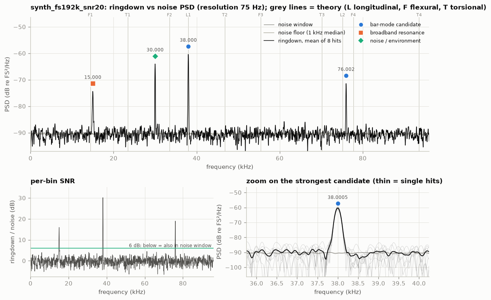
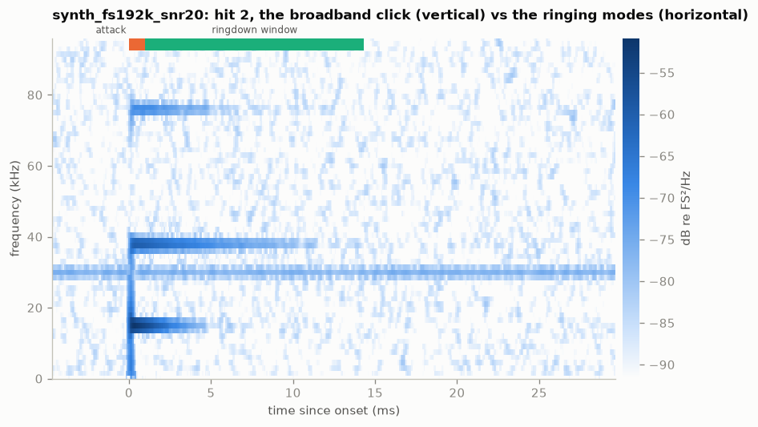
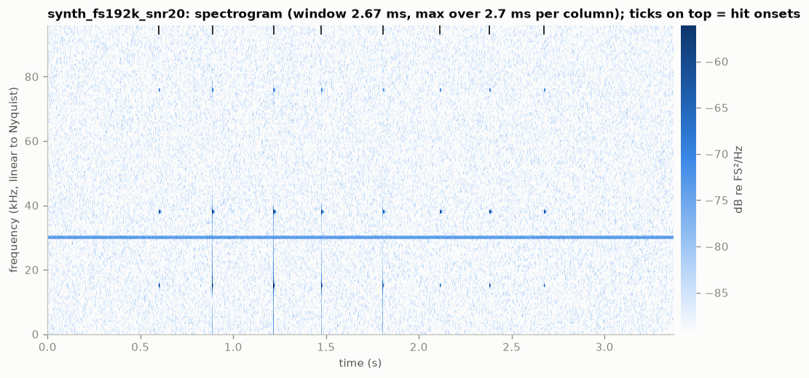
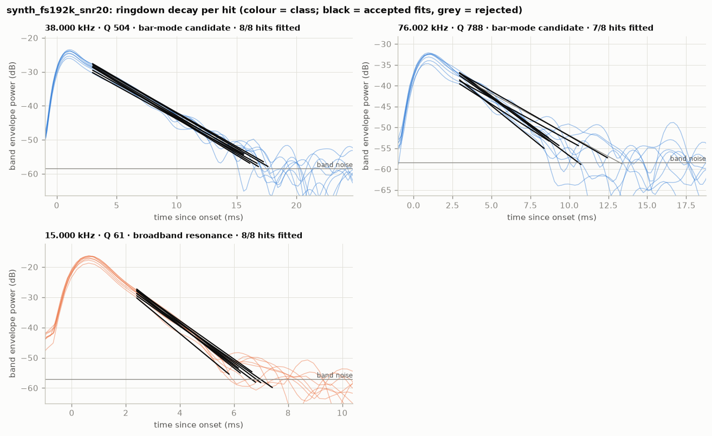
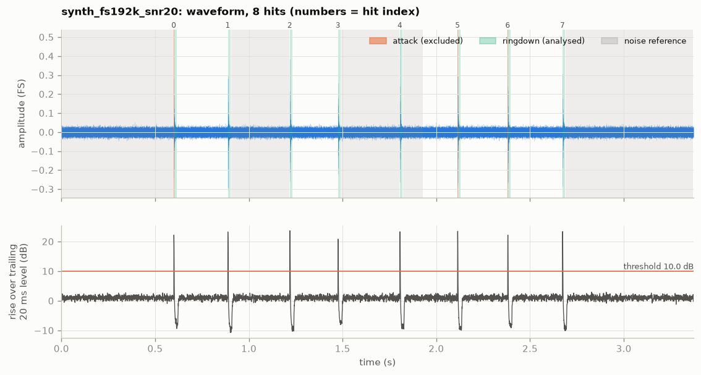

# synth_fs192k_snr20: bar ringing analysis (2026-10-06)

`data/synthetic/synth_fs192k_snr20.wav` · sha256 `c1997485898a` · 192 kHz, 16-bit, 1 ch,
3.3733 s · barlab 0.1.0 · data: [`result.json`](../synth_fs192k_snr20/result.json)

## Verdict

Ringing frequency: **38 000.5 ± 0.63 Hz** (spread over 8 hits; standard error 0.299 Hz),
Q ≈ 504 (per-hit fits). This is the strongest candidate: high Q, consistent over all hits, and 30 dB
above the noise window.
Second candidate: **76 001.9 ± 4.56 Hz** (spread over 8 hits; standard error 2.02 Hz), Q ≈ 788
(per-hit fits, 7 of 8 hits), at 19 dB.
This is a synthetic file written by `barlab demo`, so it tests the pipeline, not a real bar. Both
injected modes are recovered (see Interpretation).

## Recording quality

- **Sample rate / format:** 192000 Hz (Nyquist 96000 Hz), PCM_16, 1 channel (analysed: 0),
  3.3733 s; device: none (synthetic, no GUANO metadata).
- **Warnings:** `INFO RESOLUTION_COARSE`. At this noise level the ringdowns rise above the noise
  for only 13.3 ms (median), which allows 75 Hz PSD resolution instead of ≤ 50 Hz. The quoted
  frequencies come from per-hit phase fits and do not depend on it.
- **Hits:** 8 detected; every ringdown is 13.3 ms and ends in the noise, not at the next hit;
  clipping none; noise reference 2.0 s, no fallback.
- **Spectral resolution:** 75.0 Hz (target ≤ 50 Hz, missed because of the short usable ringdowns);
  frequencies come from per-hit phase fits, which are much finer than the PSD grid.
- **Ultrasonic content:** strongest excess above 20 kHz 29.9 dB; no roll-off.

## Detected peaks

| # | f (Hz) | ± σ hits (Hz) | Q | τ (ms) | SNR (dB) | above floor (dB) | hits fitted | class | nearest theory |
|---|---|---|---|---|---|---|---|---|---|
| 0 | 15 000.0 | 4.63 | 61.4 ± 4.84 | 1.3 | 16.0 | 16.2 | 8/8 | broadband_resonance | flexural n=1 (+4.13%) |
| 1 | 30 000.1 | — | — | — | 0.1 | 26.2 | 0/8 | noise_or_environment | flexural n=2 (-10.30%, ambiguous) |
| 2 | 38 000.5 | 0.63 | 504 ± 20.4 | 4.22 | 30.2 | 30.1 | 8/8 | bar_mode_candidate | longitudinal n=1 (+0.00%) |
| 3 | 76 001.9 | 4.56 | 788 ± 120 | 3.3 | 19.0 | 19.1 | 7/8 | bar_mode_candidate | longitudinal n=2 (+1.16%, ambiguous) |

"± σ hits" is the spread of the per-hit frequencies, and "±" after Q is the spread of the per-hit
Q values. SNR compares the ringdowns with the noise window. Theory uses the sidecar bar: L = 66.257 mm,
d = 16 mm, aluminium, free-free. Classes: bar_mode_candidate, broadband_resonance (low Q),
noise_or_environment (also present without hits).

## Interpretation

- **Measured:**
  - 38 000.5 Hz with a per-hit spread of 0.63 Hz (standard error 0.299 Hz, n = 8), Q 504 ± 20.4
    (τ 4.22 ms), SNR 30.2 dB.
  - 76 001.9 Hz with a spread of 4.56 Hz (standard error 2.02 Hz, n = 8), Q 788 ± 120 (τ 3.3 ms,
    7 of 8 hits fitted), SNR 19.0 dB.
  - 15 000.0 Hz decays fast: Q 61.4, τ 1.3 ms.
  - 30 000.1 Hz is 26.2 dB above the floor but only 0.1 dB stronger after hits than without them,
    and it has no decay.
- **Inferred:**
  - 38.0 kHz and 76.0 kHz are bar modes. They have high Q, are consistent across hits, and are
    absent from the noise window. `hit_zoom.png` shows both starting at the click and fading.
  - 38.0 kHz matches longitudinal n = 1: Rayleigh–Love gives 38 000.2 Hz (+0.00 %, unambiguous).
    The match is **circular by construction**: `barlab demo` set L = 66.257 mm from the injected
    38.0 kHz. It is a check of the code, not evidence about a real bar.
  - The family of 76.0 kHz is not identified. Longitudinal n = 2 (75 129.5 Hz) is 1.16 % below
    it, and flexural n = 4 (77 722.4 Hz) is about as close.
  - 15.0 kHz is a broadband resonance (Q 61 < 100), a mount or mic resonance in this scenario and
    not the bar's ringing.
  - 30.0 kHz is an environment line, present without hits, so it is not the bar.
  - Ground truth (`data/synthetic/synth_fs192k_snr20.truth.json`), injected against measured:

    | component | injected | measured |
    |---|---|---|
    | first bar mode | 38 000.0 Hz, Q 500 | 38 000.5 Hz, Q 504 |
    | second bar mode | 76 000.0 Hz, Q 800 | 76 001.9 Hz, Q 788 |
    | mount resonance (15 kHz, Q 60) | — | broadband_resonance |
    | 30 kHz line | — | noise_or_environment |

    The injected 38 000.0 Hz lies within two standard errors of the measured value. The click is
    not reported as a peak.
- **Caveats:**
  - The 75 Hz PSD resolution would merge two lines closer than about that. For two near-identical
    bars, such a pair would show up only as scatter between hits.
  - The 76 kHz Q varies by ± 120 between hits.
  - The signal is synthetic: an ideal mic and clean exponential decays.

## Comparison with previous recordings

| this f (Hz) | other recording | recorded | other f (Hz) | Δf = this − other (Hz) | Δf (ppm) | significance (Δf in σ) | Q this/other |
|---|---|---|---|---|---|---|---|
| 38 000.5 | synth_fs192k_snr10 | 2026-10-06 | 37 999.9 | 0.60 | 16 | 0.2 | 1.03 |
| 38 000.5 | synth_fs192k_snr40 | 2026-10-06 | 38 000.1 | 0.40 | 11 | 1.3 | 1.00 |
| 76 001.9 | synth_fs192k_snr10 | 2026-10-06 | 76 009.4 | -7.50 | -99 | 0.4 | 1.03 |
| 76 001.9 | synth_fs192k_snr40 | 2026-10-06 | 76 000.3 | 1.60 | 21 | 0.8 | 0.97 |

Both modes appear again in the other 192 kHz files. All differences are ≤ 1.3σ (≤ 99 ppm), which
is consistent with no change, as expected for the same synthetic bar. Temperature and sample clock
do not apply.

## Recommendations for the next recording session

- **Raise SNR without clipping.**
  - Put the mic closer (5–20 cm) and add gain, keeping hits at or below about −6 dBFS.
  - At this noise level each ringdown was usable for only 13.3 ms, against 22.7 ms in the SNR 40
    file. That coarsened the PSD to 75 Hz and widened the 76 kHz spread to 4.56 Hz.
- **Keep at least 8 hits.** The standard error falls with the square root of the number of hits.
- **Keep what worked here:**
  - fs ≥ 192 kHz;
  - a quiet lead-in (2.0 s of noise reference);
  - 0.3 s between hits, so every ringdown ended in the noise.
- **For real bars:**
  - measure L (±0.1 mm), the support and the temperature, and write them into
    `data/meta/<stem>.toml`;
  - with a measured L, the theory match stops being circular.
- **Find ultrasonic sources** in the room, such as the 30 kHz line here, and switch them off
  before recording.

## Figures

