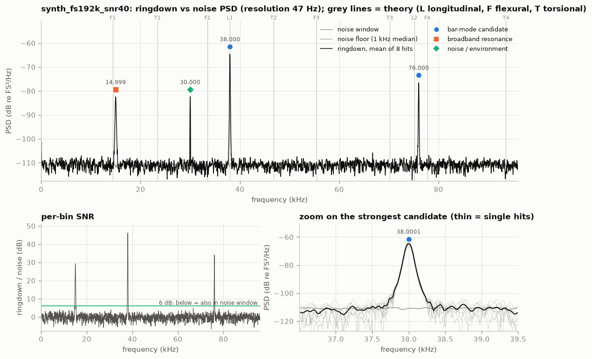
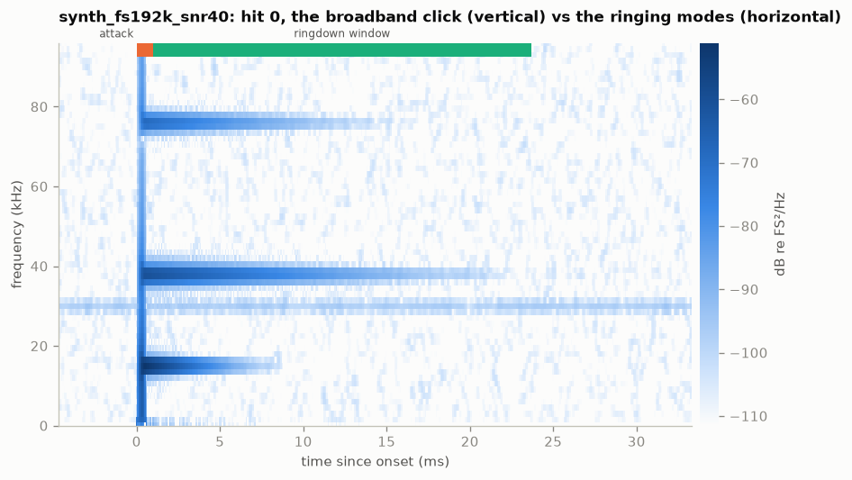
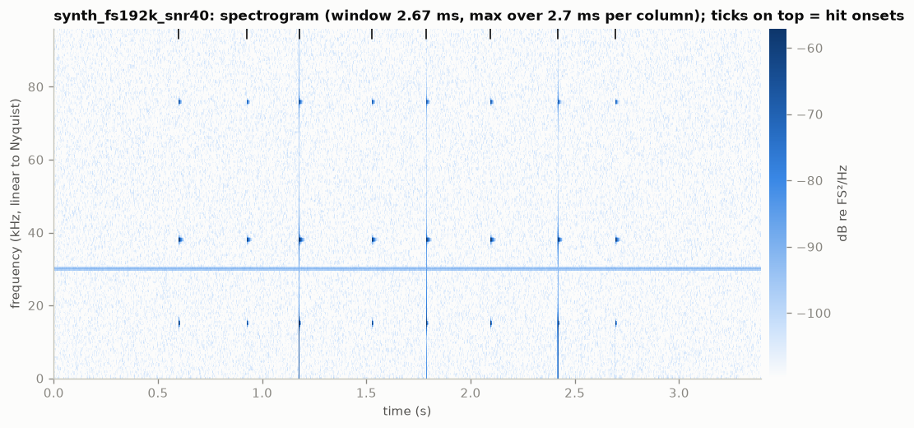
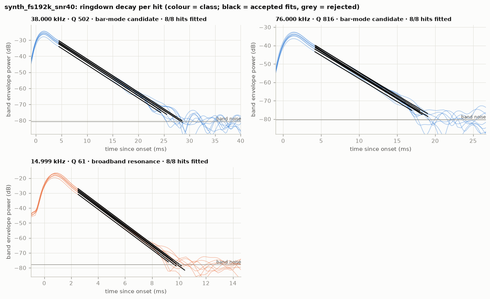
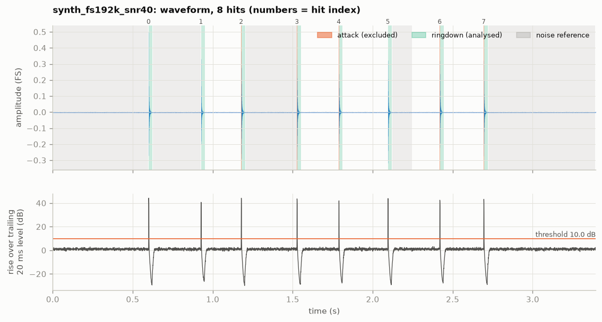

# synth_fs192k_snr40: bar ringing analysis (2026-10-06)

`data/synthetic/synth_fs192k_snr40.wav` · sha256 `2c4357a713e7` · 192 kHz, 16-bit, 1 ch,
3.3946 s · barlab 0.1.0 · data: [`result.json`](../synth_fs192k_snr40/result.json)

## Verdict

Ringing frequency: **38 000.1 ± 0.21 Hz** (spread over 8 hits; standard error 0.0914 Hz),
Q ≈ 502 (per-hit fits). This is the strongest candidate: high Q, the same frequency in every hit, and
46 dB stronger after hits than in the noise window.
Second candidate: **76 000.3 ± 0.49 Hz** (spread over 8 hits; standard error 0.215 Hz), Q ≈ 816
(per-hit fits), with the same evidence at 34 dB.
This is a synthetic file written by `barlab demo`, so it tests the pipeline, not a real bar. Both
injected modes are recovered (see Interpretation).

## Recording quality

- **Sample rate / format:** 192000 Hz (Nyquist 96000 Hz), PCM_16, 1 channel (analysed: 0),
  3.3946 s; device: none (synthetic, no GUANO metadata).
- **Warnings:** none.
- **Hits:** 8 detected; ringdowns 22.7–25.3 ms, all ending in the noise rather than at the next
  hit; clipping none; noise reference 2.0 s (lead-in and gaps between hits), no fallback.
- **Spectral resolution:** 46.9 Hz (target ≤ 50 Hz); frequencies come from per-hit phase fits,
  which are much finer than the PSD grid.
- **Ultrasonic content:** strongest excess above 20 kHz 45.5 dB; no roll-off.

## Detected peaks

| # | f (Hz) | ± σ hits (Hz) | Q | τ (ms) | SNR (dB) | above floor (dB) | hits fitted | class | nearest theory |
|---|---|---|---|---|---|---|---|---|---|
| 0 | 14 998.9 | 0.84 | 60.7 ± 0.189 | 1.29 | 29.4 | 28.4 | 8/8 | broadband_resonance | flexural n=1 (+4.13%) |
| 1 | 29 999.9 | — | — | — | 0.1 | 28.4 | 0/8 | noise_or_environment | flexural n=2 (-10.30%, ambiguous) |
| 2 | 38 000.1 | 0.21 | 502 ± 0.492 | 4.2 | 46.2 | 46.3 | 8/8 | bar_mode_candidate | longitudinal n=1 (-0.00%) |
| 3 | 76 000.3 | 0.49 | 816 ± 19.1 | 3.42 | 34.1 | 34.3 | 8/8 | bar_mode_candidate | longitudinal n=2 (+1.16%, ambiguous) |

"± σ hits" is the spread of the per-hit frequencies, and "±" after Q is the spread of the per-hit
Q values. SNR compares the ringdowns with the noise window. Theory uses the sidecar bar: L = 66.257 mm,
d = 16 mm, aluminium, free-free. Classes: bar_mode_candidate, broadband_resonance (low Q),
noise_or_environment (also present without hits).

## Interpretation

- **Measured:**
  - 38 000.1 Hz with a per-hit spread of 0.21 Hz (standard error 0.0914 Hz, n = 8), Q 502 ± 0.492
    (τ 4.2 ms), SNR 46.2 dB.
  - 76 000.3 Hz with a spread of 0.49 Hz (standard error 0.215 Hz, n = 8), Q 816 ± 19.1 (τ 3.42 ms),
    SNR 34.1 dB.
  - 14 998.9 Hz decays fast: Q 60.7, τ 1.29 ms.
  - 29 999.9 Hz is 28.4 dB above the floor but only 0.1 dB stronger after hits than in the noise
    window, and it has no decay.
- **Inferred:**
  - 38.0 kHz and 76.0 kHz are bar modes. They have high Q, agree over all 8 hits and are absent
    from the noise window. `hit_zoom.png` shows both starting at the click and fading.
  - 38.0 kHz matches longitudinal n = 1: Rayleigh–Love gives 38 000.2 Hz (−0.00 %, unambiguous).
    This match is **circular by construction**: `barlab demo` chose the sidecar L = 66.257 mm so
    that this mode falls at 38.0 kHz. It shows that the theory code and the matching work, and says
    nothing about a real bar.
  - The family of 76.0 kHz is not identified. Rayleigh–Love puts longitudinal n = 2 1.16 % below
    it (75 129.5 Hz), and flexural n = 4 (77 722.4 Hz) is nearly as close. The generator injected an
    exact 2 × 38 kHz, which on a real 16 mm bar could not be longitudinal n = 2, because dispersion
    lowers that mode. In real data, an exact 2:1 line points to nonlinearity (clipping, transducer)
    rather than a bar mode.
  - 15.0 kHz is a broadband resonance (Q 61 < 100), a mount or mic resonance in this scenario and
    not the bar's ringing. The nearest bar mode, flexural n = 1 at 14 404.6 Hz, is 4.13 % away, so
    it does not match.
  - 30.0 kHz is an environment line, present at the same level without hits. In a real room it
    would come from electronics or another ultrasonic source, not from the bar.
  - Ground truth (`data/synthetic/synth_fs192k_snr40.truth.json`), injected against measured:

    | component | injected | measured |
    |---|---|---|
    | first bar mode | 38 000.0 Hz, Q 500 | 38 000.1 Hz, Q 502 |
    | second bar mode | 76 000.0 Hz, Q 800 | 76 000.3 Hz, Q 816 |
    | mount resonance (15 kHz, Q 60) | — | broadband_resonance |
    | 30 kHz line | — | noise_or_environment |

    The impact click is not reported as a peak.
- **Caveats:** synthetic signal with an ideal flat mic and clean exponential decays. Real bars add
  support damping, two sets of modes from the two bars (close pairs that beat), clipping and mic
  roll-off. Amplitudes are uncalibrated.

## Comparison with previous recordings

| this f (Hz) | other recording | recorded | other f (Hz) | Δf = this − other (Hz) | Δf (ppm) | significance (Δf in σ) | Q this/other |
|---|---|---|---|---|---|---|---|
| 38 000.1 | synth_fs192k_snr10 | 2026-10-06 | 37 999.9 | 0.20 | 5 | 0.1 | 1.03 |
| 38 000.1 | synth_fs192k_snr20 | 2026-10-06 | 38 000.5 | -0.40 | -11 | 1.3 | 1.00 |
| 76 000.3 | synth_fs192k_snr10 | 2026-10-06 | 76 009.4 | -9.10 | -120 | 0.5 | 1.07 |
| 76 000.3 | synth_fs192k_snr20 | 2026-10-06 | 76 001.9 | -1.60 | -21 | 0.8 | 1.04 |

Both modes appear again in the SNR 20 and SNR 10 files. Every difference is ≤ 1.3σ, so nothing has
changed, which is correct: all three files hold the same synthetic bar with different noise. That
also shows the stated uncertainties are realistic. Temperature and sample clock do not apply to
synthetic data.

## Recommendations for the next recording session

- Real sessions should match this file's conditions:
  - a quiet lead-in (2.0 s of noise reference here);
  - no clipping;
  - 8 hits, each allowed to ring into the noise before the next (0.3 s apart here).
- Record at 192 kHz or more, ideally 384 kHz as the real recorder does. At 192 kHz, 76 kHz is the
  last candidate below Nyquist (96 kHz), and higher modes would be lost.
- Measure the real bars' length (±0.1 mm) and note it in `data/meta/<stem>.toml`. Here L was set
  from the injected frequency. With a measured L the theory match becomes a real test, and it can
  decide the family of a second line like 76 kHz.
- Note how the bars were struck. An end-on (axial) strike mainly excites longitudinal modes and a
  side (transverse) strike mainly excites flexural modes, which helps separate the two families.
- Look for ultrasonic sources in the room before recording (switch-mode supplies, displays,
  ultrasonic devices). A line like the 30 kHz one here costs dynamic range and can hide a weak mode.

## Figures

