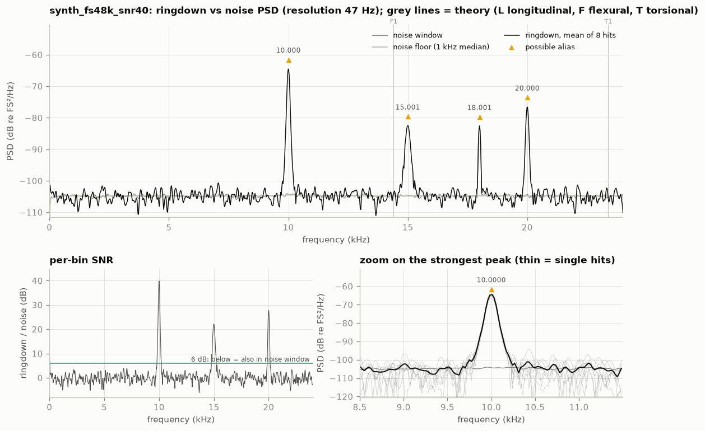
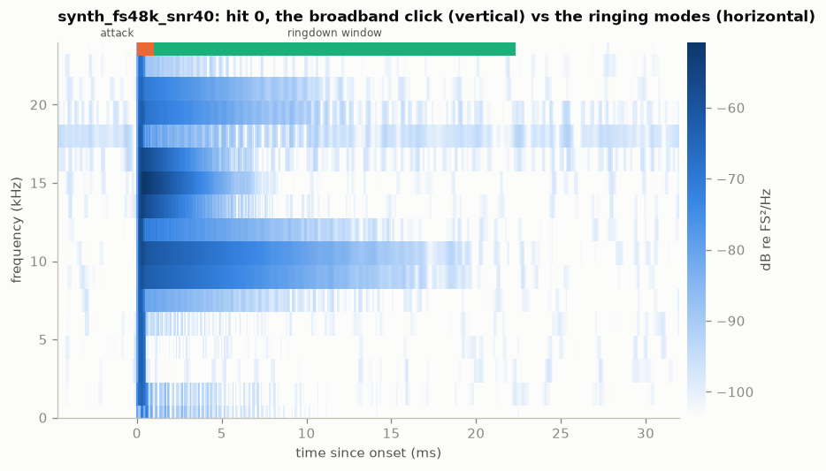
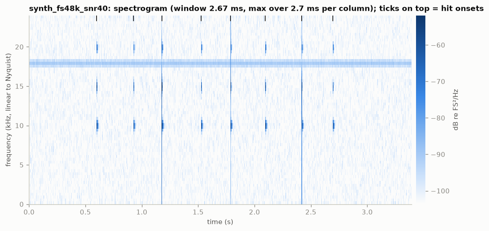
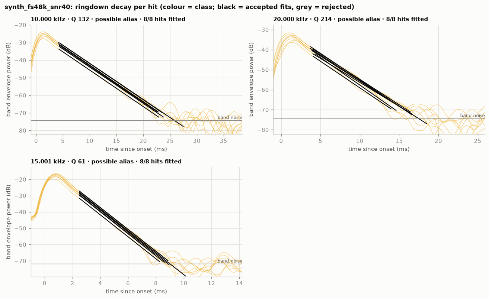
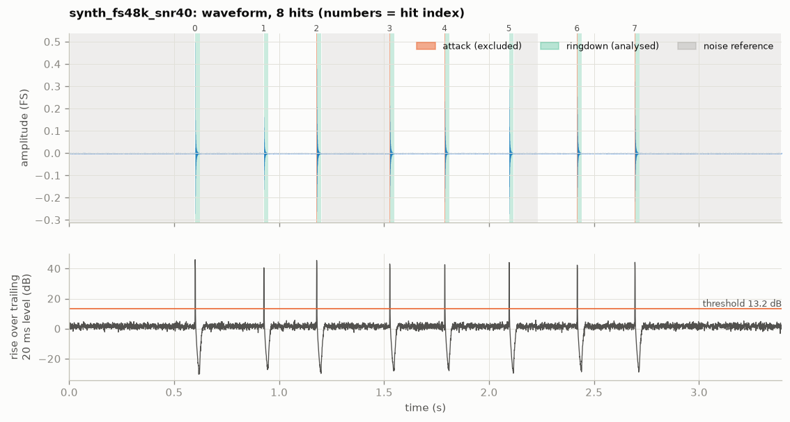

# synth_fs48k_snr40: bar ringing analysis (2026-10-06)

`data/synthetic/synth_fs48k_snr40.wav` · sha256 `34f8b7212420` · 48 kHz, 16-bit, 1 ch,
3.3945 s · barlab 0.1.0 · data: [`result.json`](../synth_fs48k_snr40/result.json)

## Verdict

**Not determinable**: CRITICAL `FS_BELOW_96K`. The file was recorded at 48 kHz, so it holds
nothing above 24 kHz. The 30–50 kHz bar modes this project is looking for either never made it
into the file or folded back below 24 kHz as aliases. None of the four peaks (10.0, 15.0, 18.0 and
20.0 kHz) can be named as the ringing frequency, and this file cannot say what it is.

## Recording quality

- **Sample rate / format:** 48000 Hz (Nyquist 24000 Hz), PCM_16, 1 channel (analysed: 0),
  3.3945 s; device: none (synthetic, no GUANO metadata).
- **Warnings:** `CRITICAL FS_BELOW_96K`: "cannot represent >fs/2; ultrasonic bar modes not
  observable; any peak found may be aliased". Everything above 24 kHz is missing or folded into
  0–24 kHz. This overrides every other result in this file.
- **Hits:** 8 detected; ringdowns 20.0–21.3 ms; clipping none; noise reference 2.0 s, no fallback.
  Hit detection works at this rate. What is lost is the frequency content.
- **Spectral resolution:** 46.9 Hz (target ≤ 50 Hz). The resolution is fine, but it does nothing
  against aliasing.
- **Ultrasonic content:** the strongest excess above 20 kHz is 25.1 dB. At this rate that band
  stops at 24 kHz, and the line in it (20.0 kHz) is itself a possible alias, so this is no
  evidence that any ultrasound was captured.

## Detected peaks

| # | f (Hz) | ± σ hits (Hz) | Q | τ (ms) | SNR (dB) | above floor (dB) | hits fitted | class | nearest theory |
|---|---|---|---|---|---|---|---|---|---|
| 0 | 10 000.0 | 0.39 | 132 ± 0.882 | 4.21 | 39.9 | 40.1 | 8/8 | possible_alias | — |
| 1 | 15 001.1 | 1.70 | 60.9 ± 0.337 | 1.29 | 22.1 | 22.4 | 8/8 | possible_alias | — |
| 2 | 18 001.5 | — | — | — | -0.1 | 22.2 | 0/8 | possible_alias | — |
| 3 | 20 000.1 | 1.94 | 214 ± 8.59 | 3.41 | 27.8 | 28.3 | 8/8 | possible_alias | — |

`possible_alias`: because fs < 96 kHz, each line may be a fold of content above 24 kHz. barlab
therefore gives these peaks no theory match. The Q column is π·f·τ computed with the folded
frequency, so it is not a bar's Q.

## Interpretation

- **Measured:**
  - Three lines decay after each hit and agree across all 8 hits: 10 000.0 Hz (τ 4.21 ms),
    15 001.1 Hz (τ 1.29 ms) and 20 000.1 Hz (τ 3.41 ms).
  - 18 001.5 Hz is just as strong without hits (SNR −0.1 dB) and does not decay.
- **Inferred:**
  - In a 48 kHz file, a line at f can be real content at f or a fold of anything at
    |k·48 kHz ± f|. The file cannot tell which, so no peak qualifies as a bar-mode candidate and
    none is compared with bar theory.
  - High Q and consistency between hits do not help. 10.0 and 20.0 kHz look like textbook modes,
    because a folded mode keeps its decay time and its consistency; only its frequency is wrong.
    The decay time τ survives aliasing, but Q does not.
  - For this synthetic file the ground truth shows what happened (`truth.json`,
    `observed_f_hz`):
    - the injected 38 kHz mode appears at 10.0 kHz;
    - the 76 kHz mode appears at 20.0 kHz;
    - the continuous 30 kHz line appears at 18.0 kHz;
    - only the 15 kHz resonance is really at 15 kHz.

    Nothing in the recording itself would reveal this. That is why the verdict is "not
    determinable" rather than a guess.
- **Caveats:** this file was synthesised directly at 48 kHz without an anti-alias filter, so the
  modes fold perfectly. A real 48 kHz recorder low-passes before sampling, and the mic may roll off
  too, so the bar modes would mostly be missing rather than folded. Either way, the file cannot
  answer the question.

## Comparison with previous recordings

synth_fs48k_snr40: no bar-mode candidates, nothing to compare.

Its lines must not be matched against the 38.0 and 76.0 kHz modes of the 192 kHz files: a folded
frequency is a different quantity. `barlab compare` correctly leaves this file out of the
mode table.

## Recommendations for the next recording session

- **Record at 192 kHz or more; 384 kHz is preferred.** The PYG USB detector used for the real
  recordings runs at 384 kHz. Check the sample-rate setting in the recorder or app before every
  session.
- **Don't try to rescue a 48 kHz file by resampling or filtering.** Whatever was above 24 kHz is
  gone or mixed irreversibly with in-band content. Record it again instead.
- **Keep the rest of this setup:** 8 clean hits, no clipping, and a 2.0 s quiet noise reference.
- **Read the first lines of `barlab analyze`'s output for every new file.** A CRITICAL line there
  means the file cannot answer the question, whatever the plots look like.

## Figures

